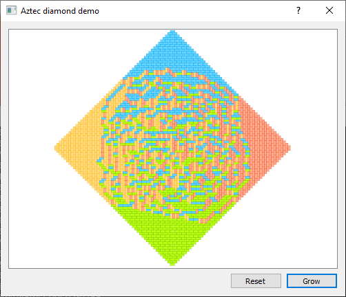

# Aztec Diamond Calculator

A simple `python` implementation of the "Aztec diamond" algorithm explained by [Mathologer in a recent video](https://www.youtube.com/watch?v=Yy7Q8IWNfHM), complete with a simple GUI for observing how the pattern changes as the order increases.

The implementation uses numpy for moderate efficiency (computes A100 from A99 in ~20ms).
The growth pattern can be randomly assigned (the default) or a function can be provided to specify how to populate empty blocks.

Validated against the worked example in the mathologer video (see `test.py`).

The GUI requires `PySide2` (python3) or `PySide` (python2), base version only requires `numpy`.